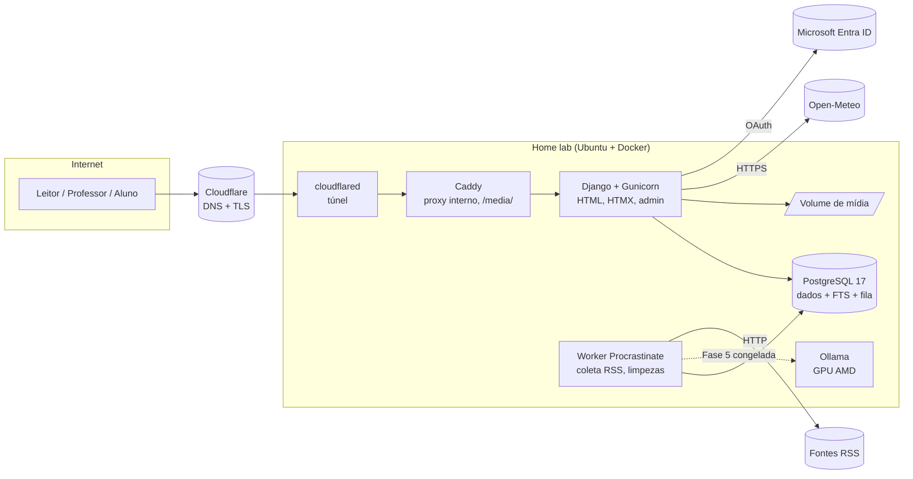

# 05 — Arquitetura técnica

## Resumo da stack escolhida

| Camada | Escolha | Versão alvo | Motivo em uma linha |
|---|---|---|---|
| Linguagem | Python | 3.13 | Competência do desenvolvedor |
| Framework web | Django | 5.2 LTS | Auth, admin, ORM, migrações, formulários, sessões, CSRF, storage: tudo pronto. Suporte até abril de 2028 |
| Renderização | Django Templates + HTMX 2 + Alpine.js 3 | — | Interatividade sem SPA; um só projeto |
| CSS | Tailwind CSS 4 | — | Produtividade sem escrever CSS do zero; design system em tokens |
| Editor de texto | TipTap 3 (vanilla, sem React) | — | ProseMirror com API amigável; saída JSON estruturada |
| Build de assets | Vite | — | Só para empacotar TipTap, Alpine, HTMX e Tailwind. Integrado via django-vite |
| Banco | PostgreSQL | 17 | Já usado; FTS, JSONB, pgvector futuro |
| Busca | PostgreSQL FTS (`django.contrib.postgres`) + `unaccent` + `pg_trgm` | — | Suficiente para o volume; zero infra extra |
| Arquivos | Sistema de arquivos em volume Docker, via `django-storages` abstraído | — | Trocar para MinIO/S3 é configuração |
| Imagens | Pillow + variantes geradas no upload (WebP) | — | Sem serviço externo |
| Autenticação | Sessão Django + `django-allauth` (Microsoft Entra ID) + senha de reserva | — | Contas institucionais da escola; sem cadastro aberto |
| Servidor de aplicação | Gunicorn | — | Padrão, simples |
| Estáticos | WhiteNoise | — | Serve estáticos sem Nginx |
| Borda | Cloudflare (DNS, TLS, túnel) + Caddy interno | — | Sem portas abertas; `/media/` servido pelo Caddy |
| Clima | Open-Meteo (API pública gratuita, auto-hospedável) | — | Sem chave; chamada do servidor com cache |
| Tarefas em segundo plano | Procrastinate (a partir da Fase 4) | — | Fila em PostgreSQL, sem Redis, tarefas periódicas |
| IA local (Fase 5, congelada) | Ollama com ROCm + pgvector | — | GPUs AMD Instinct disponíveis; dados de menores não saem do servidor |
| IA externa (opcional, congelada) | API da Anthropic (Claude) | — | Só para conteúdo sem dados pessoais |
| Containers | Docker Compose | — | Um comando para subir tudo |
| Testes | pytest, pytest-django, factory-boy, Playwright (poucos e2e) | — | — |
| Qualidade | ruff, djlint, pre-commit, mypy opcional | — | — |
| CI | GitHub Actions (lint + testes) | — | — |

## Diagrama de componentes

Fases 1 a 3 usam Cloudflare, Caddy, Django e PostgreSQL. Worker entra na Fase 4; Ollama só se a Fase 5 for descongelada.

## Decisões arquiteturais

Cada decisão segue: problema, alternativas, trade-offs, decisão, consequência.

### D1. Monólito Django com renderização no servidor

**Problema.** O projeto precisa de páginas públicas com bom SEO, um painel autenticado e um editor rico. O desenvolvedor domina Python e tem pouca experiência em frontend moderno.

**Alternativas.**
1. Next.js + FastAPI (dois projetos, API JSON, autenticação por token).
2. React + Vite + FastAPI (idem, sem SSR; SEO fraco).
3. Django com templates, HTMX para interações parciais, Alpine.js para estado local, e um único bundle JS para o editor.
4. Flask com o mesmo desenho do item 3.

**Trade-offs.**
- (1) e (2) dão a interface mais "moderna" no papel, mas exigem manter dois deploys, duas linguagens de validação, CORS, refresh de tokens, hidratação, e uma pessoa aprendendo React enquanto constrói o produto. Para um site majoritariamente de leitura, SPA é peso morto.
- (3) entrega 90% da interatividade necessária (filtros sem recarregar, reações, autosave, comentários) com uma fração do código. O editor rico é o único componente que precisa de JS de verdade, e TipTap funciona sem React.
- (4) Flask exigiria montar auth, admin, migrações, formulários, upload, permissões e proteção CSRF a partir de bibliotecas soltas. Django traz tudo isso testado.
- FastAPI é excelente para APIs, mas este projeto é um site, não uma API.

**Decisão.** Opção 3: Django monolítico.

**Consequência.** Um único processo, um único deploy, um único repositório. A "API" do MVP são rotas HTML e endpoints internos. Se um dia houver app móvel, adiciona-se django-ninja com endpoints somente leitura sem reescrever nada. O custo é aceitar que algumas interações (arrastar e soltar, edição colaborativa) serão mais difíceis; nenhuma delas está no MVP.

### D2. Django 5.2 LTS

**Problema.** Escolher versão estável com suporte longo.

**Alternativas.** Django 5.2 LTS (abril 2025, suporte até abril 2028) ou a versão mais recente da série 6.x.

**Decisão.** 5.2 LTS. Atualizar para a próxima LTS (6.2, prevista para 2027) quando estiver madura.

**Consequência.** Menos surpresas com bibliotecas de terceiros. O framework de tarefas nativo do Django 6 não é usado; Procrastinate cobre a necessidade.

### D3. HTMX + Alpine.js em vez de um framework JS

**Problema.** Filtros, reações, autosave, comentários e fila de revisão precisam de atualizações parciais sem recarregar a página.

**Alternativas.** HTMX (troca de fragmentos HTML), Alpine.js (estado local pequeno), Stimulus, ou um framework completo.

**Decisão.** HTMX para tudo que envolve servidor (a view devolve um fragmento de template). Alpine.js para estado puramente local (abrir/fechar menu, contador de caracteres, abas). Nada de framework.

**Consequência.** Views Django devolvem HTML parcial quando a requisição vem do HTMX. Templates ganham a convenção `partials/`. O time (uma pessoa) escreve quase só Python e HTML.

### D4. TipTap como editor; armazenar JSON + HTML + texto

**Problema.** Professores e alunos precisam de um editor visual com títulos, imagens, links, listas, citações, e no futuro vídeos. O conteúdo precisa ser seguro para renderizar, pesquisável e editável depois.

**Alternativas.**
1. Markdown com editor de texto: simples de armazenar, mas professores não conhecem Markdown; imagens e legendas ficam desajeitadas.
2. Editor HTML (CKEditor, TinyMCE, Quill): saída HTML livre, difícil de validar e de evoluir; risco de XSS se a sanitização falhar.
3. Editor.js: blocos JSON, vanilla, mas ecossistema menor e edição inline limitada.
4. TipTap (ProseMirror): documento JSON com esquema estrito; extensões oficiais para imagem, link, YouTube, tabela; funciona sem React; renderização server-side possível a partir do JSON.
5. Lexical: excelente, mas orientado a React.

**Decisão.** TipTap 3 em modo vanilla, empacotado com Vite.

**Armazenamento.** Três campos na publicação:
- `body_json` (JSONB): documento ProseMirror, fonte de verdade, o que o editor carrega.
- `body_html` (text): HTML renderizado no servidor a partir do JSON por um renderizador Python próprio (esquema fechado: só nós e marcas conhecidos são emitidos). Cacheado; regenerado a cada salvamento.
- `body_text` (text): texto puro para busca e para calcular tempo de leitura.

**Consequência.** O HTML nunca vem do navegador. O servidor só emite tags que o renderizador conhece, o que elimina XSS por construção. O custo é escrever e manter um renderizador JSON → HTML (cerca de 150 linhas) e mantê-lo em sincronia com as extensões habilitadas no editor.

### D5. PostgreSQL full-text search

**Problema.** Busca em títulos, corpo, autores e disciplinas com acentuação e erros de digitação leves.

**Alternativas.** PostgreSQL FTS; Meilisearch; Elasticsearch/OpenSearch; Typesense.

**Trade-offs.** Soluções dedicadas oferecem tolerância a erros e ranking melhores, mas adicionam um serviço, sincronização de índice e memória. Um jornal escolar terá centenas, talvez poucos milhares de publicações.

**Decisão.** PostgreSQL com `SearchVectorField` materializado, configuração `portuguese`, extensão `unaccent` para acentos e `pg_trgm` para similaridade em nomes de professores e sugestões. Detalhes em [19](19-busca-e-filtros.md).

**Consequência.** Zero infra extra. Se um dia for necessário, Meilisearch pode ser adicionado sem mudar o modelo de dados.

### D6. Arquivos em volume local, abstraídos

**Problema.** Fotos de perfil e imagens de publicações.

**Alternativas.** Filesystem; MinIO local; S3/R2 externo.

**Decisão.** Filesystem em volume Docker no MVP, usando a API de storage do Django. Configuração pronta para trocar por MinIO (S3 compatível) via `django-storages` mudando variáveis de ambiente. Backups do volume junto com o banco.

**Consequência.** Simplicidade máxima agora; migração barata depois. Caddy serve `/media/` diretamente do volume.

### D7. Autenticação com a conta Microsoft da escola, senha como reserva

**Problema.** Contas só para a equipe; leitores anônimos; professores já têm conta institucional Microsoft; não há e-mail para enviar convites ou recuperar senha.

**Alternativas.** Sessão Django com e-mail + senha; JWT; OAuth Microsoft via `django-allauth`; magic link por e-mail (inviável sem e-mail).

**Decisão.** `django-allauth` com o provedor Microsoft (Entra ID) como caminho principal, restrito a domínios permitidos e a contas previamente criadas pelo admin. Senha como reserva, ativada por link de primeiro acesso gerado pelo admin e entregue manualmente. Sem cadastro aberto. JWT descartado.

**Consequência.** A maioria nunca cria senha. O risco é o tenant do estado bloquear o aplicativo; se acontecer, a reserva vira o padrão sem mudança de código. 2FA para admin via `django-otp` (Evolução).

### D8. Sem fila até a Fase 4; sem e-mail; notificações no painel

**Problema.** Coleta de RSS e limpezas periódicas são tarefas assíncronas, mas só na Fase 4. Não há servidor de e-mail.

**Alternativas.** Celery + Redis; Django-Q2; Huey; Procrastinate (PostgreSQL); cron com comandos de gerenciamento. Para avisos: e-mail (indisponível), notificações no painel, push (excessivo).

**Decisão.** Nenhuma fila até a Fase 4; limpezas por comando de gerenciamento em cron do host. Notificações são registros em banco exibidos no painel (sino). Na Fase 4, Procrastinate no mesmo PostgreSQL. E-mail por serviço gratuito é Evolução, acoplado ao mesmo modelo `Notification`.

**Consequência.** Nenhum Redis, nenhum SMTP. Um container `worker` só na Fase 4.

### D9. IA local com adaptador de provedor (Fase 5, congelada)

**Problema.** Classificar notícias, gerar resumos, sugerir títulos, detectar duplicatas. Dados de alunos não podem sair do servidor.

**Alternativas.** Apenas modelos locais (Ollama/vLLM com ROCm); apenas API externa; híbrido com política por tipo de dado.

**Decisão.** Interface `AIProvider` em `apps/ai/` com duas implementações: `OllamaProvider` (padrão) e `AnthropicProvider` (opcional). Uma política simples decide: qualquer texto que contenha conteúdo de aluno ou dados pessoais vai só para o provedor local. Notícias externas (conteúdo público) podem usar qualquer provedor. Embeddings sempre locais, armazenados em `pgvector`.

**Consequência.** O código de negócio não sabe qual modelo responde. Trocar de modelo é configuração. Detalhes em [22](22-ia.md).

### D10. Configurações de site em banco

**Problema.** Nome do jornal, política de autopublicação, textos da página "Sobre", e-mail de contato mudam sem deploy.

**Decisão.** Modelo `SiteSetting` (chave, valor JSON, descrição) editado pelo Django Admin, com cache em memória e helper `get_setting("editorial.self_publish")`. Sem biblioteca externa.

### D11. Versão do sistema visível

**Problema.** O dono do projeto quer saber, olhando o rodapé, qual versão está no ar, e ter um histórico de mudanças.

**Decisão.** SemVer com arquivo `VERSION`, `CHANGELOG.md`, tags git e `make release`. Versão no rodapé, no `/healthz/` e em cabeçalho HTTP. Detalhes em [30](30-versionamento.md).

**Consequência.** Disciplina leve a cada fechamento de fase; nenhum custo em tempo de execução.

## Comparação resumida das alternativas de frontend

| Critério | Django Templates + HTMX | React + Vite + API | Next.js + API |
|---|---|---|---|
| Curva para o desenvolvedor | Baixa | Alta | Alta |
| Projetos a manter | 1 | 2 | 2 |
| SEO | Nativo | Ruim | Bom (SSR) |
| Editor rico | TipTap vanilla | TipTap React | TipTap React |
| Interações parciais | HTMX | Nativo | Nativo |
| Tempo até o MVP | Menor | Maior | Maior |
| Adequação a site de leitura | Excelente | Regular | Boa |

## Comparação resumida de backend

| Critério | Django | FastAPI | Flask |
|---|---|---|---|
| Auth, admin, ORM, migrações prontos | Sim | Não | Não |
| Serve HTML com formulários e CSRF | Sim | Possível, manual | Possível, manual |
| Ideal para API JSON pura | Bom (ninja/DRF) | Excelente | Bom |
| Adequação a este projeto | Alta | Baixa | Média |

## Histórico

- 2026-09-12: versão inicial.
- 2026-09-12: D7 (Microsoft + senha de reserva), D8 (sem e-mail, notificações no painel), D11 (versionamento), Cloudflare e Open-Meteo na stack, IA congelada.
