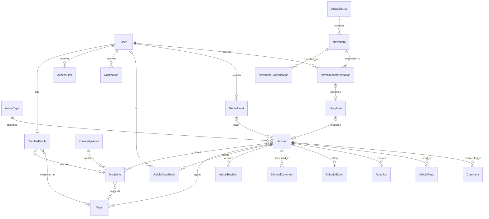

# 06 — Modelo de dados

## Princípios

- Nomes em inglês, `snake_case`. Chaves primárias inteiras; UUID só onde o identificador vai em URL sensível (links de acesso, chaves anônimas).
- `created_at` e `updated_at` em todas as tabelas de negócio.
- Exclusão lógica só onde há valor histórico (publicações, usuários). O resto é exclusão física.
- Tabelas da Fase 4 estão descritas para que o MVP não tome decisões que as inviabilizem. Tabelas da Fase 5 (IA) estão listadas apenas por nome; a fase está congelada.

## Visão geral por app

| App Django | Tabelas |
|---|---|
| `accounts` | `User`, `TeacherProfile`, `AccessLink` |
| `taxonomy` | `KnowledgeArea`, `Discipline`, `Topic`, `ArticleType` |
| `publications` | `Article`, `ArticleContributor`, `ArticleRevision`, `MediaAsset` |
| `editorial` | `EditorialComment`, `EditorialEvent`, `Notification` |
| `engagement` | `Reaction`, `ArticleRead`, `Comment` |
| `core` | `SiteSetting`, `AuditLog`, `StaticPage`, `ErrorLog` |
| `curation` (Fase 4) | `NewsSource`, `NewsItem`, `NewsItemClassification`, `NewsRecommendation`, `StoryIdea` |
| `ai` (Fase 5, congelada) | `Embedding`, `AIJob` |

## Tabelas

### accounts.User

Modelo customizado desde a primeira migração. Login por e-mail institucional (Microsoft) ou senha.

| Campo | Tipo | Notas |
|---|---|---|
| id | bigint PK | |
| email | varchar, único | Minúsculas. Chave de correspondência com a conta Microsoft |
| password | varchar | Hash Argon2; vazio (`unusable`) para quem só usa Microsoft |
| full_name | varchar(150) | |
| display_name | varchar(80) | Nome público |
| role | varchar(10) | `staff`, `editor`, `admin` |
| staff_kind | varchar(12) | `teacher`, `monitor`, `coordinator`, `principal`, `librarian`, `other` |
| is_active | bool | Desativar sem apagar |
| is_staff, is_superuser | bool | Acesso ao Django Admin (só `admin`) |
| avatar | FK MediaAsset nullable | |
| last_login, date_joined | timestamp | |
| deactivated_at | timestamp nullable | |

Índices: `email` único; `role`.

Implementação (E03):

- `is_staff` e `is_superuser` são calculados no `save()` a partir de `role`: verdadeiros só para `admin`, falsos para os demais. Não se editam à mão.
- `avatar` entra na E11, junto com `MediaAsset`.
- `display_name` vazio usa `full_name` (`User.public_name`).
- O login compara o e-mail em minúsculas; `createsuperuser` pede e-mail e nome completo e cria um `admin`.

### accounts.TeacherProfile (1:1 User)

Nome mantido por tradição; vale para todos os cargos.

| Campo | Tipo | Notas |
|---|---|---|
| user | OneToOne User | |
| slug | varchar, único | URL do perfil |
| headline | varchar(120) | "Professora de Biologia", "Monitor escolar" |
| bio | text (≤ 800) | |
| education | JSONB | Lista de `{degree, institution, year}` |
| since_year | smallint nullable | |
| links | JSONB | Lista de `{label, url}`, máximo 4 |
| disciplines | M2M Discipline | |
| areas | M2M KnowledgeArea | |
| topics | M2M Topic | Interesses; usados pela curadoria |
| accepts_english | bool | Sugestões em inglês (Fase 4), padrão true |
| is_public | bool | |
| show_reviewer_credit | bool | |
| reviewers_may_publish | bool | Padrão ao pedir revisão |
| show_reads | bool | Mostrar leituras nas próprias publicações |
| onboarded_at | timestamp nullable | Assistente de primeiro acesso concluído ou pulado; vazio leva ao assistente no login |

### accounts.AccessLink

Substitui convite por e-mail. Gerado pelo admin e entregue manualmente.

| Campo | Tipo | Notas |
|---|---|---|
| id | uuid PK | Vai na URL |
| user | FK User | Conta já criada pelo admin |
| purpose | varchar | `first_access`, `password_reset` |
| created_by | FK User | |
| expires_at | timestamp | 7 dias |
| used_at | timestamp nullable | Uso único |

### taxonomy.KnowledgeArea

| Campo | Tipo | Notas |
|---|---|---|
| name, slug | varchar | |
| short_name | varchar(30) | Nome no menu do cabeçalho ("Natureza"); vazio usa `name` (E21) |
| description | text | |
| color | varchar(16) | Nome de uma cor do design system |
| order | smallint | |
| is_active | bool | |

### taxonomy.Discipline

| Campo | Tipo | Notas |
|---|---|---|
| area | FK KnowledgeArea | |
| name, slug, description, order, is_active | | |

### taxonomy.Topic

| Campo | Tipo | Notas |
|---|---|---|
| name, slug | varchar | |
| disciplines | M2M Discipline | Sugeridas quando o tópico aparece |
| keywords | JSONB | Termos para classificação (Fase 4) |
| is_active | bool | Sugestões de professores entram inativas |

### taxonomy.ArticleType

| Campo | Tipo | Notas |
|---|---|---|
| name, slug, description, order, is_active | | Dez tipos no seed |
| has_event_date | bool | Tipo Evento exige `event_at` |

### publications.Article

| Campo | Tipo | Notas |
|---|---|---|
| id | bigint PK | |
| title | varchar(120) | |
| subtitle | varchar(220) | Linha fina |
| slug | varchar, único | Gerado na publicação; imutável depois |
| type | FK ArticleType | |
| status | varchar(20) | `draft`, `in_review`, `changes_requested`, `published`, `archived` |
| body_json | JSONB | Documento TipTap |
| body_html | text | Renderizado no servidor |
| body_text | text | Busca e tempo de leitura |
| cover | FK MediaAsset nullable | |
| cover_caption | varchar(200) | |
| disciplines | M2M Discipline | Ao menos uma |
| topics | M2M Topic | |
| event_at | timestamp nullable | |
| event_location | varchar(120) | |
| sources | JSONB | Lista de `{title, url, publisher}` |
| origin_news_item | FK NewsItem nullable (Fase 4) | |
| reading_minutes | smallint | |
| is_featured, featured_order | bool, smallint nullable | |
| comments_enabled | bool | Padrão true |
| created_by | FK User | |
| submitted_at, published_at, archived_at | timestamp nullable | |
| reads_count | int | |
| reactions_count | JSONB | `{"interesting": 24, ...}` |
| comments_count | int | Só aprovados |
| search_vector | tsvector | |
| created_at, updated_at | | |

Índices: `slug` único; `(status, published_at desc)`; GIN em `search_vector`; `is_featured`; `event_at`.

### publications.ArticleContributor

| Campo | Tipo | Notas |
|---|---|---|
| article | FK Article | |
| user | FK User nullable | Membro da equipe |
| display_name | varchar(80) | Obrigatório se `user` nulo; se houver `user`, copiado no momento (crédito congelado) |
| role | varchar | `author`, `coauthor`, `collaborator`, `reviewer`, `editor` |
| is_student | bool | Crédito de aluno (sempre sem `user`) |
| class_group | varchar(20) | "2ª série B"; só para aluno |
| consent_ok | bool | Professor declara ter autorização; obrigatório para aluno |
| contribution_note | varchar(80) | "fotos", "entrevista" |
| can_publish | bool | Para `reviewer`: "pode publicar por mim" |
| order | smallint | |
| show_in_credits | bool | |

Restrição: `(article, user, role)` único quando `user` não nulo; `is_student` implica `user` nulo. Índice `(user, role)`.

### publications.ArticleRevision

| Campo | Tipo |
|---|---|
| article, number, title, subtitle, body_json, created_by, reason (`published`, `submitted`, `edited_after_publish`, `manual`), created_at | |

### publications.MediaAsset

| Campo | Tipo | Notas |
|---|---|---|
| file | FileField | Original reescrito, sem EXIF |
| variants | JSONB | `{"w480": path, "w960": path, "w1600": path}` WebP |
| width, height, size_bytes, mime | | |
| alt_text | varchar(250) | |
| credit | varchar(120) | |
| license | varchar(40) | `own`, `cc-by`, `cc-by-sa`, `public-domain`, `authorized` |
| has_people | bool | |
| consent_ok | bool | |
| uploaded_by | FK User | |
| article | FK Article nullable | |
| created_at | | |

### editorial.EditorialComment

| Campo | Tipo |
|---|---|
| article, author, parent nullable, body, anchor_text (≤300) nullable, anchor_from, anchor_to, status (`open`, `resolved`), resolved_by, resolved_at, created_at, updated_at | |

### editorial.EditorialEvent

| Campo | Tipo | Notas |
|---|---|---|
| article, actor, from_status, to_status | | Nulos quando não muda estado |
| kind | varchar | `status_change`, `reviewer_assigned`, `reviewer_removed`, `approved`, `contributor_changed`, `edited_after_publish`, `edited_by_third_party`, `credit_anonymized` |
| note | text | |
| created_at | | |

Índices: `(article, created_at)`; `(actor, created_at)`.

### editorial.Notification (MVP)

| Campo | Tipo | Notas |
|---|---|---|
| user | FK User | |
| kind | varchar | `review_requested`, `changes_requested`, `approved`, `published_by_other`, `edited_by_other`, `archived_by_other`, `comment_pending`, `review_stale`, `system` |
| article | FK nullable | |
| message | varchar(200) | |
| url | varchar(300) | |
| read_at | timestamp nullable | |
| created_at | | |

Índice `(user, read_at, created_at desc)`. Retenção: lidas com mais de 90 dias são apagadas.

### engagement.Reaction

| Campo | Tipo |
|---|---|
| article, user nullable, anon_key uuid nullable, kind, created_at | |

Unicidade `(article, user)` e `(article, anon_key)`; exatamente um dos dois preenchido.

### engagement.ArticleRead

`(article, viewer_key varchar(64), day date, created_at)`, único `(article, viewer_key, day)`. Registros com mais de 90 dias são apagados.

### engagement.Comment (Fase 3)

| Campo | Tipo | Notas |
|---|---|---|
| article | FK Article | |
| author_name | varchar(60) | Público |
| body | text (≤ 1000) | Texto puro; URLs removidas |
| status | varchar | `pending`, `approved`, `rejected` |
| anon_key | uuid nullable | |
| ip_hash | char(64) | Sal mensal |
| had_links | bool | |
| reply_body | text nullable | Resposta da equipe |
| replied_by | FK User nullable | |
| moderated_by, moderated_at | FK User nullable, timestamp nullable | |
| created_at | | |

Índices: `(article, status, created_at)`; `(status, created_at)`. Rejeitados apagados após 30 dias.

### core.SiteSetting

`key` (PK), `value` (JSONB), `description`, `updated_at`. Chaves iniciais: `site.name` ("Jornal Escolar"), `site.tagline` ("Jornal digital da comunidade escolar"), `site.footer_credit` ("Desenvolvido por Professor Marcos Felipe A. D. da Silva"), `site.contact_email` (`marcossilva06@professor.educacao.sp.gov.br`), `editorial.self_publish` (`staff`), `credits.student_name_policy` (`first_initial`), `home.featured_count`, `reactions.require_login`, `reads.min_seconds`, `comments.enabled`, `weather.enabled`.

### core.StaticPage

`slug`, `title`, `body_json`, `body_html`, `updated_by`, `updated_at`.

### core.ErrorLog

Sem e-mail para o admin, erros 500 ficam em tabela: `path`, `method`, `exception`, `traceback`, `user nullable`, `created_at`. Retenção 30 dias. Listado no admin.

### core.AuditLog

`actor nullable`, `action`, `target_type`, `target_id`, `changes` (JSONB), `ip_hash`, `created_at`.

### curation.* (Fase 4)

Inalteradas em relação ao desenho original: `NewsSource` (nome, feed, `kind`, idioma, `trust_level`, tópicos e disciplinas padrão, intervalo, último erro, ativo), `NewsItem` (fonte, título, URL, URL canônica, `url_hash` único, `title_hash`, resumo ≤ 600, `image_url`, datas, idioma, oculto), `NewsItemClassification` (item, tópico/disciplina, score, método), `NewsRecommendation` (usuário, item, score, status, pauta, datas; único por usuário e item), `StoryIdea` (título, notas, proposto por, item, disciplinas, tópicos, status, atribuído a, publicação).

### ai.* (Fase 5, congelada)

`Embedding` e `AIJob` conforme [22](22-ia.md). Não criadas antes da fase.

## Diagrama conceitual

## Entidades consideradas e descartadas

| Entidade | Decisão | Motivo |
|---|---|---|
| `StudentProfile` / contas de aluno | Descartada | Alunos não têm conta; são créditos em `ArticleContributor` |
| `Invitation` por e-mail | Substituída por `AccessLink` | Sem e-mail no sistema |
| `views` bruta permanente | `ArticleRead` com retenção | Privacidade e tamanho |
| `interests` própria | Fundida em `Topic` | Um vocabulário só |
| `categories` de notícia | `NewsItemClassification` | Unifica taxonomia |
| `WeatherSnapshot` | Descartada | Clima fica em cache, não em tabela |

## Histórico

- 2026-09-12: versão inicial.
- 2026-09-12: reescrito: sem `StudentProfile` e `Invitation`; `AccessLink`, `staff_kind`, campos de aluno em `ArticleContributor`, `Comment`, `Notification` no MVP, `ErrorLog`, novas chaves de configuração.
- 2026-09-12: E21: `KnowledgeArea.short_name` para o menu do cabeçalho; os nomes completos das áreas ("Ciências da Natureza e suas Tecnologias") não cabem numa linha. A migração preenche as seis áreas do seed.
- 2026-09-14: E23: `TeacherProfile.onboarded_at`. Quem já tinha entrado alguma vez é marcado como concluído pela migração.
- 2026-09-14: E25: `StaticPage` troca o texto simples `body` por `body_json` e `body_html` (a migração converte os parágrafos) e mantém `lead` e `is_published`.
- 2026-09-14: E29: `EditorialEvent` criado, com os tipos `reviewer_removed` (pedido cancelado ou revisão recusada) e `approved` (docs/04 e docs/17 já citavam o evento de aprovação). `Article.status` ganha `in_review` e `changes_requested`.
