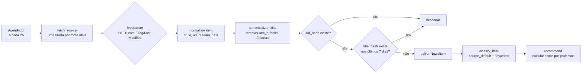

# 21 — Curadoria de notícias externas

Camada: **Evolução** · Fase 4 (classificação e resumo por IA na Fase 5)

## Objetivo

Ser uma **curadora de pautas**, não uma copiadora. O sistema mostra ao professor notícias recentes das áreas que lhe interessam, com o mínimo necessário para decidir se vale virar uma matéria original do jornal. Nunca reproduz o conteúdo.

## Princípios

1. **Só metadados.** Título, resumo curto fornecido pelo feed (até 600 caracteres), fonte, data, link. Nunca o texto integral. Imagens não são baixadas.
2. **Fontes escolhidas por humanos.** O administrador cadastra as fontes e define o nível de confiança. Não há "descoberta automática" de fontes.
3. **O link leva à fonte.** Sempre. A publicação derivada cita a fonte na lista de referências.
4. **Sugestão, não obrigação.** Ignorar é uma ação de um clique e treina a recomendação.

## Fontes: RSS como base, API como complemento

### Por que RSS primeiro

| Critério | RSS de fontes curadas | APIs de notícias (GNews, NewsData, NewsAPI) |
|---|---|---|
| Custo | Zero | Gratuito só com limites baixos (100 a 200 requisições/dia), atraso de horas e cláusulas que restringem uso; planos pagos a partir de dezenas de dólares/mês |
| Controle de qualidade | Total: só entra o que o admin cadastrou | Baixo: mistura fontes de qualidade variada |
| Direitos | Feeds são publicados para agregação; usamos título, resumo e link | Termos variam; muitos proíbem armazenamento |
| Cobertura em português | Boa para ciência, educação e tecnologia | Boa, mas sem controle |
| Manutenção | Feeds quebram ocasionalmente; `feedparser` tolera mal-formação | Mudanças de contrato e chaves |

**Decisão:** RSS/Atom via `feedparser` como mecanismo principal. Uma integração opcional com **uma** API de notícias (GNews ou NewsData, escolhida na Fase 4 conforme termos vigentes) para buscas por palavra-chave dos tópicos que as fontes RSS não cobrem. A API é tratada como mais uma `NewsSource` de `kind = api`.

### Fontes iniciais sugeridas (o admin confirma)

| Fonte | Tipo de conteúdo | Confiança sugerida |
|---|---|---|
| Agência Brasil (EBC) | Notícias gerais, educação, ciência | 5 |
| Agência FAPESP, Pesquisa FAPESP | Divulgação científica | 5 |
| Jornal da USP, Agência Bori | Ciência, universidade | 5 |
| Ciência Hoje, Revista Galileu | Divulgação científica | 4 |
| Nova Escola, Porvir | Educação | 4 |
| Olhar Digital, Tecnoblog, Canaltech | Tecnologia | 3 |
| BBC News Brasil | Geral | 4 |
| Nexo Jornal (feed público) | Explicativo | 4 |
| Instituto Butantan, Fiocruz, INPE, IBGE (notícias) | Ciência e dados | 5 |
| MEC, secretaria estadual de educação | Institucional | 4 |
| Nature (inglês), MIT Technology Review (inglês) | Ciência e tecnologia | 5 (idioma `en`) |

Fontes em inglês são mostradas com etiqueta de idioma para quem mantiver "aceito sugestões em inglês" ligado no perfil (padrão ligado, conforme decisão em [27](27-decisoes-pendentes-e-perguntas.md)). Todas as fontes listadas são gratuitas; nenhuma API paga entra.

## Pipeline de coleta

Executa como tarefa periódica no worker Procrastinate ([D8](05-arquitetura-tecnica.md)).



### Normalização

- Título: strip, colapsar espaços, remover sufixo " - Nome do veículo".
- Resumo: HTML removido, truncado em 600 caracteres na última frase completa.
- Data: `published_parsed`, senão `updated_parsed`, senão hora da coleta.
- URL canônica: seguir redirecionamento uma vez (HEAD), remover parâmetros de rastreamento, normalizar esquema e host, remover fragmento.
- `title_hash`: SHA-256 do título em minúsculas, sem acentos e sem pontuação.

### Deduplicação

| Nível | Método | Fase |
|---|---|---|
| Mesma URL | `url_hash` único | 4 |
| Mesmo título em fontes diferentes | `title_hash` nos últimos 7 dias | 4 |
| Mesma notícia com títulos diferentes | Similaridade de embeddings > 0,92 nos últimos 7 dias; agrupa como "também em: Fonte B" | 5 |

### Higiene

- Itens com mais de 60 dias são apagados, exceto os com `NewsRecommendation` em `saved`, `interesting` ou `converted`.
- Fonte com 5 falhas consecutivas é marcada com `last_error` e aparece em alerta no admin; não é desativada automaticamente.
- Respeito a `robots.txt` não se aplica a feeds (são publicados para consumo), mas o `User-Agent` identifica o jornal e um e-mail de contato.

## Classificação

Objetivo: atribuir tópicos e disciplinas prováveis a cada item, com um score.

| Método | Como | Fase | Confiança |
|---|---|---|---|
| `source_default` | Tópicos e disciplinas padrão da fonte (ex.: tudo da Agência FAPESP é "Ciência") | 4 | 0,4 |
| `keyword` | `Topic.keywords` (lista mantida pelo admin: "inteligência artificial", "IA", "machine learning" → tópico IA). Busca sem acento no título (peso 2) e resumo (peso 1). Score normalizado | 4 | 0,3 a 0,9 |
| `embedding` | Similaridade entre embedding do item e embedding da descrição do tópico | 5 (congelada) | 0,5 a 0,95 |
| `llm` | Modelo local classifica em lista fechada de tópicos com justificativa de uma linha | 5 (congelada) | 0,7 a 0,98 |

Disciplinas são derivadas dos tópicos (`Topic.disciplines`) e das disciplinas padrão da fonte. Um item pode ter vários tópicos; a tela mostra os de score ≥ 0,5.

Classificação errada é corrigível: o professor pode, ao salvar ou criar pauta, ajustar tópicos; a correção grava `NewsItemClassification` com `method = manual` e score 1,0, e alimenta os exemplos para a Fase 5.

## Recomendação

Para cada professor com `TeacherProfile.topics` ou `disciplines`, ao chegar um item:

```
score = 0.5 * max(similaridade de tópicos)        # item tem tópico que o professor marcou
      + 0.2 * (item tem disciplina do professor)
      + 0.2 * recência (1.0 hoje → 0 em 14 dias, linear)
      + 0.1 * (trust_level / 5)
      - 0.3 se o professor ignorou ≥ 3 itens desse mesmo tópico nos últimos 30 dias
      - 1.0 se idioma não aceito
```

Itens com score ≥ 0,45 geram `NewsRecommendation(status = suggested)`. Máximo de 30 sugestões ativas por professor; as mais antigas expiram para `ignored` silenciosamente.

Feedback:
- **Ignorar**: `ignored`; reduz peso do tópico dominante para aquele professor.
- **Salvar**: `saved`; aparece na aba "Salvas".
- **Interessante**: `interesting`; aumenta peso do tópico e da fonte para o professor; também sinaliza aos editores ("3 professores acharam interessante").
- **Virar pauta**: cria `StoryIdea` com título sugerido ("Pauta: <título da notícia>"), fonte pré-preenchida, tópicos e disciplinas; status `converted`.

Personalização mais sofisticada (filtragem colaborativa) é desnecessária com dezenas de usuários; a heurística acima é explicável e ajustável.

## Da sugestão à publicação

1. Professor clica "Virar pauta". Nasce um `StoryIdea` atribuído a ele.
2. Na tela de pautas, "Criar rascunho": nasce um `Article` em `draft` com título da pauta, `sources` com a notícia original (título, URL, veículo), disciplinas e tópicos pré-marcados e `origin_news_item` preenchido. O corpo começa vazio, com um bloco de dica não salvo: "Escreva com suas palavras. Cite a fonte. Pergunte: o que isso significa para a nossa escola?".
3. A checklist de publicação exige ao menos uma fonte citada quando `origin_news_item` existe.
4. Ao publicar, a pauta vai a `done`.

## Tela de sugestões

Descrita em [15](15-painel-professor.md). Cada card:

```
┌───────────────────────────────────────────────────────────┐
│ Agência FAPESP ●●●●● · 11 set 2026 · português            │
│ Pesquisadores criam sensor de baixo custo para medir       │
│ qualidade do ar em escolas ↗                              │
│ Resumo do feed em até três linhas…                        │
│ #Meio ambiente #Sensores  · Química, Física, Geografia     │
│ [Ignorar] [Salvar] [Interessante] [Virar pauta]           │
└───────────────────────────────────────────────────────────┘
```

Rodapé da página: "As notícias pertencem às fontes. O jornal exibe apenas título, resumo e link."

## Confiabilidade e direitos

- **Confiabilidade**: `trust_level` definido por humano; fontes com nível ≤ 2 só aparecem se o professor ligar "incluir fontes de menor confiança". Sem "verificação automática de fatos".
- **Direitos autorais**: resumo vem do próprio feed (o veículo publicou para agregação) e é truncado; sem texto integral; sem imagens armazenadas; link e nome da fonte sempre visíveis; conteúdo derivado é original. Se um veículo pedir remoção, o admin desativa a fonte e o sistema apaga os itens dela.
- **Retenção**: 60 dias, salvo itens marcados.

## Complexidade e riscos

| Risco | Mitigação |
|---|---|
| Feeds instáveis | `feedparser` tolerante, ETag, alerta de falhas |
| Palavras-chave ruins geram sugestões irrelevantes | Ignorar treina; admin ajusta `keywords`; Fase 5 melhora |
| Poucas fontes em português para algumas disciplinas (Artes, Educação Física) | Aceitar fontes em inglês; cadastrar blogs institucionais; pautas manuais |
| Professor nunca abre a tela | Notificação semanal no painel com "5 sugestões novas para você"; e-mail só se um serviço for ligado (Evolução) |

## Histórico

- 2026-09-12: versão inicial.
- 2026-09-12: inglês ligado por padrão; só fontes gratuitas; avisos no painel em vez de e-mail; métodos de IA marcados como congelados.
- 2026-09-17: **E45** feita (app `curation`: `NewsSource`, `NewsItem`, coleta, normalização, canonicalização, admin com "Buscar agora", comandos `seed_news_sources` e `fetch_news`). Decisões e desvios:
  - Agendador: a tarefa `fetch_news` passa a cada 30 minutos (5 e 35 de cada hora) e enfileira `fetch_news_source` só para as fontes cujo intervalo (`fetch_interval_minutes`, padrão 120, mínimo 30) já passou, com 10 minutos de tolerância. Assim o "a cada 2h" do diagrama vira o padrão por fonte.
  - Fontes iniciais conferidas em 2026-09-17 (`apps/curation/seed_data.py`, 15 fontes, criadas ativas): Agência Brasil (Últimas notícias e Educação), Pesquisa FAPESP, Jornal da USP, Agência Bori, INPE, Revista Galileu, Porvir, BBC News Brasil, Nexo Jornal, Olhar Digital, Tecnoblog, Canaltech, Nature e MIT Technology Review. Ficaram de fora: Agência FAPESP (feed com erro 500), Nova Escola e MEC (sem feed encontrado), IBGE e Instituto Butantan (recusam o acesso com 403), Ciência Hoje (feed parado em 2017) e Fiocruz (feed parado em 2025). O admin pode cadastrar outras a qualquer momento.
  - HEAD para seguir redirecionamentos só nos links ainda desconhecidos (até 8 em paralelo, 5 s cada); se o site recusar HEAD, fica o link do feed. Até 50 itens por coleta.
  - `url_hash` é calculado sem o esquema e sem `www.`, para http e https do mesmo endereço contarem como uma notícia. `title_hash` já é gravado, mas só passa a descartar repetidos na E46.
  - Resumo também perde o rodapé do WordPress ("O post … apareceu primeiro em …") e HTML escapado duas vezes; imagem guarda só o endereço (`image_url`) quando o feed informa.
  - Segurança: só http e https, feed de até 5 MB, 15 s de tempo limite, até 5 redirecionamentos e nenhum pedido para endereços de rede interna, nem em redirecionamentos. `User-Agent` com o nome do jornal, o site e o e-mail de contato das configurações.
  - Falhas: cada coleta com erro soma em `consecutive_failures` e grava `last_error`; com 5 ou mais, a fonte aparece com aviso na lista do admin. Sucesso zera a contagem. Nenhuma fonte é desativada sozinha.
- 2026-09-20: **E46** feita (deduplicação por título e retenção). Decisões e desvios:
  - Título repetido: descarta quando o `title_hash` bate com o de uma notícia publicada até 7 dias antes ou depois (`TITLE_DEDUP_WINDOW`). Fica a que chegou primeiro, independentemente da confiança da fonte — a escolha da melhor versão é da E48, na tela de sugestões.
  - Só títulos marcantes entram (`normalize.is_distinctive_title`: 4 palavras ou mais depois de tirar acentos e pontuação). Sem esse corte, "Editorial", "Newsletter" e "Podcast da semana" fundiriam notícias diferentes de veículos diferentes.
  - A conferência acontece duas vezes: uma em bloco antes dos HEAD, para não gastar requisição com o que já vai ser descartado, e outra na hora de gravar, protegida por `pg_advisory_xact_lock` sobre o `title_hash`. Sem a trava, duas coletas simultâneas (o worker dispara uma tarefa por fonte) passariam as duas pela verificação e gravariam o mesmo título.
  - Retenção conta `fetched_at`, não `published_at`: pela data de publicação, uma notícia antiga que continua no feed seria apagada e coletada de novo a cada meia hora.
  - `purge_old_items` entrou no comando `cleanup` e na tarefa diária das 4h30, junto com as limpezas de leituras e comentários; o resultado aparece como `noticias_antigas`.
  - `delete_source_items` e a ação no admin atendem "Confiabilidade e direitos": apagam o que foi coletado de um veículo que pediu remoção, sem descadastrar a fonte.
