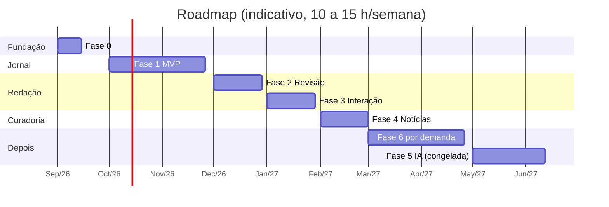

# 25 — Roadmap

Seis fases. A Fase 5 (IA) está **congelada** por decisão do dono do projeto até que tudo o mais esteja funcional; permanece no roadmap como referência. Versões de software por fase em [30](30-versionamento.md).

Estimativas em semanas de trabalho de uma pessoa, em ritmo de projeto pessoal (10 a 15 h/semana).

## Fase 0 — Planejamento e fundação → v0.1.0

**Funcionalidades:** esta documentação; repositório com estrutura; Compose de dev; projeto Django rodando; CI; `CLAUDE.md`; design tokens, marca e template base; `VERSION` e rodapé com versão.

**Tarefas não técnicas:** redigir com a direção o termo de autorização de nome e imagem de alunos; registrar o app no Entra ID (conta Azure gratuita); configurar DNS e túnel na Cloudflare.

**Complexidade:** baixa. **Risco:** perder tempo polindo ferramentas. **Duração:** 1 a 2 semanas.

**Resultado:** `make dev` sobe uma página com o masthead do "Jornal Escolar" e o design system aplicado; `make test` passa; `jornal.projetosrosa.com.br` responde uma página "em breve" via túnel.

## Fase 1 — MVP: o jornal no ar → v1.0.0

**Funcionalidades:**
- Usuário customizado, papéis e cargos, login Microsoft e senha de reserva, links de primeiro acesso, contas criadas pelo admin.
- Taxonomia com seed da escola e admin.
- Publicação: modelo, créditos (equipe, alunos, sem conta), mídia, editor TipTap com autosave e upload, renderizador servidor, checklist.
- Fluxo: `draft` → `published` pelo autor; `archived`; edição por editor com notificação.
- Notificações no painel (modelo `Notification` e sino), já que não há e-mail.
- Páginas públicas: home, publicação, lista com filtros básicos, área, disciplina, tipo, agenda, quem escreve, perfil, páginas estáticas, erros.
- Perfil da equipe e assistente de primeiro acesso.
- Destaques da home.
- Deploy em produção via túnel, backup, monitor externo.

**Dependências:** Fase 0; termo de autorização aprovado antes de publicar com aluno.

**Complexidade:** alta. **Riscos:** editor e upload; login Microsoft bloqueado pelo tenant do estado (fallback: senha).

**Duração:** 6 a 8 semanas.

**Resultado:** a equipe escreve e publica; leitores leem. O jornal existe.

## Fase 2 — Revisão opcional, moderação e conta → v1.1.0

**Funcionalidades:**
- Pedir revisão a colega; estados `in_review` e `changes_requested`; "pode publicar por mim".
- Tela de revisão com comentários editoriais ancorados; histórico; `ArticleRevision`.
- Painel editorial para editores (visão geral, todas as publicações, alertas).
- Exportar e anonimizar usuário; auditoria; "Conta" completa.

**Dependências:** Fase 1 em uso real.

**Complexidade:** média. **Duração:** 3 a 4 semanas.

**Resultado:** quem quiser uma segunda leitura tem como pedir; editores enxergam o todo.

## Fase 3 — Busca e interação → v1.2.0

**Funcionalidades:**
- Busca full-text com ranking e trechos; busca de pessoas por similaridade.
- Filtros completos via HTMX; ordenação por leituras.
- Reações; contador de leituras.
- **Comentários públicos moderados** com fila de moderação no painel.
- **Clima "Hoje na escola"** com Open-Meteo ([29](29-clima.md)).
- "Leia também"; feed RSS; página de tópico.

**Dependências:** Fase 1. Pode correr em paralelo com a Fase 2.

**Complexidade:** média. **Riscos:** spam em comentários (mitigado por moderação prévia e limites). **Duração:** 4 semanas.

**Resultado:** o site é navegável por qualquer critério e a comunidade interage com segurança.

## Fase 4 — Curadoria de notícias → v1.3.0

**Funcionalidades:** worker Procrastinate; fontes RSS gratuitas (português e inglês); coleta, deduplicação; classificação por palavras-chave; recomendação por interesses; tela de sugestões; pautas; limpezas periódicas.

**Dependências:** Fases 1 e 3 (tópicos em uso).

**Complexidade:** média. **Duração:** 4 semanas.

**Resultado:** o professor abre o painel e encontra pautas relevantes.

## Fase 5 — IA → v2.0.0 (congelada)

Descrita em [22](22-ia.md). Só começa quando o dono do projeto decidir, após as Fases 1 a 4 estarem estáveis. Nenhuma etapa de outra fase depende dela. As tabelas `Embedding` e `AIJob` não são criadas antes.

## Fase 6 — Funcionalidades avançadas (por demanda)

Candidatas: e-mail por serviço gratuito; agendamento; diff de versões; coleções/edições; vídeos; modo escuro (tokens já preparados); API pública somente leitura; estatísticas no perfil; facetas; 2FA; "reportar problema"; Plausible/Umami; arquivo `.ics` da agenda (um arquivo que o leitor abre para adicionar o evento ao calendário do celular ou do Outlook).

**Regra:** nada entra sem pedido concreto após meses de uso.

## Linha do tempo indicativa

## Marcos de decisão

| Marco | Pergunta a responder antes de seguir |
|---|---|
| Fim da Fase 0 | O login Microsoft funcionou com uma conta real? Se não, a Fase 1 assume senha como padrão. |
| Fim da Fase 1 | A equipe está publicando? Se não, o problema é produto: parar e ajustar. |
| Fim da Fase 3 | Os comentários estão sendo moderados em tempo razoável? Se não, reduzir a quem pode comentar ou desligar por publicação. |
| Antes da Fase 4 | A equipe preencheu interesses? Sem isso a curadoria não recomenda nada. |
| Antes da Fase 5 | Tudo estável? A classificação por palavras-chave é ruim o bastante para justificar IA? |

## Histórico

- 2026-09-12: versão inicial.
- 2026-09-12: reescrito conforme respostas: revisão opcional, comentários e clima na Fase 3, IA congelada, versões por fase.
